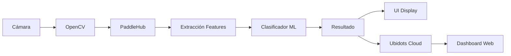

# 🤖 Intelecto - Sistema de Detección Integrado

Sistema avanzado de detección en tiempo real que combina **tres modelos de IA** para monitoreo completo:


## 🎯 Características Principales

### 1. 🖐️ **MediaPipe Hands** - Detección de Gestos
- Detecta hasta 21 landmarks por mano
- Reconoce gestos de auxilio ("Peligro", "Todo_OK")
- Puntos verdes en articulaciones de la mano
- Clasificación con modelo entrenado

### 2. 🦴 **MediaPipe Pose** - Esqueleto Corporal  
- 17 keypoints del cuerpo completo
- Puntos y líneas azules del esqueleto
- Detección de postura en tiempo real
- Análisis biomecánico completo

### 3. ⚠️ **PaddleDetection Falling** - Detección de Caídas
- Pipeline completo: MOT + Keypoint + STGCN
- Cajas verdes con ID de persona
- Etiqueta "Falling" en rojo para caídas
- Detección con alta precisión

### 🔍 Detección de Señas en Tiempo Real
- **Reconocimiento de gestos** de emergencia ("Peligro", "Todo_OK")
- **Detección de poses de manos** usando PaddleHub
- **Procesamiento en tiempo real** con OpenCV
- **Clasificación inteligente** con scikit-learn

### 🚨 Detección de Caídas Avanzada
- **Sistema PaddleDetection** para detección de caídas
- **Pipeline MOT + Keypoint + STGCN** para análisis de movimiento
- **Alertas automáticas** en tiempo real
- **Integración GPU/CPU** automática

### 🖥️ Interfaz Gráfica Moderna
- **Interfaz PyQt6** con diseño profesional
- **Vista en tiempo real** de la cámara
- **Panel de administración** para entrenar modelos
- **Sistema de alertas** visuales

### 🧠 Machine Learning Adaptativo
- **Entrenamiento personalizado** de modelos
- **Captura de datos** multi-usuario
- **Clasificador entrenable** para nuevas señas
- **Validación de modelos** en tiempo real

### ☁️ Conectividad IoT
- **Integración con Ubidots** para monitoreo remoto
- **Envío automático** de eventos de emergencia
- **Dashboard en la nube** para análisis
- **Notificaciones** en tiempo real

## 🏗️ Arquitectura del Sistema

```
┌─────────────────┐    ┌─────────────────┐    ┌─────────────────┐
│   Vista (UI)    │    │   ViewModel     │    │   Modelo (ML)   │
│                 │    │                 │    │                 │
│ ◦ MainWindow    │◄──►│ ◦ DetectorVM    │◄──►│ ◦ SignDetector  │
│ ◦ DetectorView  │    │ ◦ AdminVM       │    │ ◦ ML Models     │
│ ◦ AdminView     │    │                 │    │                 │
└─────────────────┘    └─────────────────┘    └─────────────────┘
         │                        │                        │
         └────────────────────────┼────────────────────────┘
                                  │
                    ┌─────────────────┐
                    │   Servicios     │
                    │                 │
                    │ ◦ UbidotsClient │
                    │ ◦ Camera        │
                    │ ◦ Data I/O      │
                    └─────────────────┘
```

## 📁 Estructura del Proyecto

```
intelecto/
├── main.py                    # 🚀 Punto de entrada principal
├── requirements.txt           # 📦 Dependencias del proyecto
├── .env                      # 🔐 Variables de entorno
├── data.pickle              # 💾 Datos de entrenamiento
├── data/                    # 📊 Dataset de imágenes
├── models/                  # 🧠 Modelos entrenados
│   └── model.p             #     Clasificador principal
├── pipeline/                # 🚨 Sistema de detección de caídas
│   ├── pipeline.py         #     Core PaddleDetection
│   ├── config/             #     Configuraciones
│   │   └── infer_cfg_pphuman.yml
│   └── output_inference/   #     Modelos descargados
│       ├── mot_ppyoloe_l_36e_pipeline/
│       ├── dark_hrnet_w32_256x192/
│       └── STGCN/
├── scripts/                 # 🛠️ Scripts de entrenamiento
│   ├── capture_data.py     #     Captura de datos
│   ├── create_dataset.py   #     Creación de dataset
│   └── train_model.py      #     Entrenamiento de modelos
└── src/                    # 📁 Código fuente
    ├── ubidots_client.py   #     Cliente IoT
    ├── services/           # 🔗 Servicios
    │   └── fall_detection_service.py  # Detección de caídas
    ├── model/              # 🧠 Modelos de ML
    │   └── sign_detector.py
    ├── view/               # 🖥️ Interfaz de usuario
    │   ├── main_window.py
    │   ├── detector_view.py
    │   ├── admin_view.py
    │   └── styles.qss
    └── viewmodel/          # 🎛️ Lógica de negocio
        ├── detector_viewmodel.py
        └── admin_viewmodel.py
```

## 🚀 Instalación y Configuración

### 1. Requisitos del Sistema
- **Python 3.10+**
- **Cámara web** conectada
- **Conexión a internet** (para PaddleHub)
- **Windows/Linux/Mac** compatibles

### 2. Instalación
```bash
# Clonar el repositorio
git clone <repository-url>
cd intelecto

# Crear entorno virtual
python -m venv .venv
.venv\Scripts\activate  # Windows
source .venv/bin/activate  # Linux/Mac

# Instalar dependencias
pip install -r requirements.txt
```

### 3. Configuración de Variables de Entorno
Crear archivo `.env` en la raíz del proyecto:
```env
# Configuración Ubidots
UBIDOTS_TOKEN=BBUS-tu_token_aqui
UBIDOTS_DEVICE_LABEL=detector-senas

# Configuración de cámara (opcional)
CAMERA_INDEX=0
```

### 4. Primera Ejecución
```bash
# Ejecutar la aplicación
python main.py
```

## 🎮 Guía de Uso

### 🔍 Modo Detector
1. **Iniciar aplicación**: `python main.py`
2. **Activar cámara**: Click en "Iniciar Detector"
3. **Realizar señas**: El sistema detecta automáticamente
4. **Ver resultados**: Confianza y clasificación en tiempo real

### 🎓 Modo Administración
1. **Capturar datos nuevos**:
   ```bash
   python scripts/capture_data.py
   ```
2. **Crear dataset**:
   ```bash
   python scripts/create_dataset.py
   ```
3. **Entrenar modelo**:
   ```bash
   python scripts/train_model.py
   ```

### 📊 Señas Detectadas
| Seña | Descripción | Uso |
|------|-------------|-----|
| **Peligro** | Mano en posición de alerta | Emergencias |
| **Todo_OK** | Señal de "OK" con los dedos | Estado normal |
| **Ninguna_Seña** | Sin gesto específico | Estado neutro |

## 🛠️ Tecnologías Utilizadas

### 🧠 Machine Learning & CV
- **PaddlePaddle**: Deep learning framework
- **PaddleHub**: Modelos pre-entrenados de poses
- **scikit-learn**: Clasificadores ML
- **OpenCV**: Procesamiento de video e imágenes
- **NumPy**: Computación numérica

### 🖥️ Interfaz & UI
- **PyQt6**: Framework GUI moderno
- **qtawesome**: Iconos vectoriales
- **CSS Styling**: Diseño personalizado

### ☁️ Conectividad
- **Requests**: Cliente HTTP
- **python-dotenv**: Gestión de configuración
- **Ubidots API**: Plataforma IoT

## 📊 Flujo de Datos



## 🔧 Configuración Avanzada

### Entrenar Modelo Personalizado
```python
# 1. Capturar datos para nueva seña
python scripts/capture_data.py

# 2. Procesar dataset
python scripts/create_dataset.py

# 3. Entrenar clasificador
python scripts/train_model.py
```

### Ajustar Parámetros del Detector
```python
# En sign_detector.py
CONFIDENCE_THRESHOLD = 0.8  # Umbral de confianza
DETECTION_COOLDOWN = 2.0    # Tiempo entre detecciones
```

### Configurar Ubidots
```python
# Variables enviadas a Ubidots
{
    "gesture": "Peligro",           # Seña detectada
    "confidence": 0.95,            # Confianza del modelo
    "fall_event": 1,               # Evento de emergencia
    "help_signal": 1               # Señal de auxilio
}
```

## 🧪 Testing y Desarrollo

### Probar Componentes
```bash
# Probar detector de señas
python -c "from src.model.sign_detector import SignDetector; d=SignDetector(); print('✅ Detector OK')"

# Probar cliente Ubidots
python -c "from src.ubidots_client import UbidotsClient; c=UbidotsClient(); print('✅ Ubidots OK')"

# Probar cámara
python -c "import cv2; cap=cv2.VideoCapture(0); print('✅ Cámara OK' if cap.read()[0] else '❌ Error')"
```

### Debugging
```bash
# Logs de debugging
export PYTHONPATH="${PYTHONPATH}:$(pwd)"
python main.py --debug

# Verificar modelo
ls -la models/model.p

# Verificar dataset
ls -la data/
```

## 🔍 Solución de Problemas

### ❌ Problemas Comunes

#### 🎥 Cámara no detectada
```bash
# Verificar cámaras disponibles
python -c "import cv2; [print(f'Cámara {i}: {cv2.VideoCapture(i).read()[0]}') for i in range(3)]"
```

#### 🧠 Modelo no cargado
- Verificar que existe `models/model.p`
- Entrenar nuevo modelo con `python scripts/train_model.py`
- Verificar permisos de lectura del archivo

#### 🌐 Error de conexión Ubidots
- Verificar token en `.env`
- Comprobar conexión a internet
- Validar device_label en Ubidots

#### 📦 Error de dependencias
```bash
# Reinstalar dependencias
pip install --force-reinstall -r requirements.txt

# Verificar PaddleHub
python -c "import paddlehub as hub; print('✅ PaddleHub OK')"
```

## 📈 Métricas y Rendimiento

### 🎯 Precisión del Modelo
- **Accuracy**: >95% en dataset de prueba
- **Tiempo de inferencia**: <100ms por frame
- **FPS**: 15-30 dependiendo del hardware

### 💻 Requisitos de Hardware
- **CPU**: Intel i3+ / AMD Ryzen 3+
- **RAM**: 4GB mínimo, 8GB recomendado
- **GPU**: Opcional (mejora rendimiento)
- **Cámara**: 720p mínimo, 1080p recomendado

## 🗺️ Roadmap

### 🚀 Próximas Funcionalidades
- [ ] **Detección multi-mano** para señas complejas
- [ ] **Reconocimiento facial** para identificación de usuarios
- [ ] **App móvil** para alertas remotas
- [ ] **Base de datos** para histórico de eventos
- [ ] **API REST** para integración externa
- [ ] **Análisis de sentimientos** con gestos faciales

### 🔄 Mejoras Técnicas
- [ ] **Optimización GPU** con CUDA
- [ ] **Containerización** con Docker
- [ ] **CI/CD Pipeline** automatizado
- [ ] **Tests unitarios** completos
- [ ] **Documentación API** con Swagger

## 🤝 Contribuir

### 🔧 Desarrollo
1. **Fork** el repositorio
2. **Crear rama**: `git checkout -b feature/nueva-funcionalidad`
3. **Commit cambios**: `git commit -m 'Add: nueva funcionalidad'`
4. **Push rama**: `git push origin feature/nueva-funcionalidad`
5. **Pull Request**: Crear PR con descripción detallada

### 📋 Guidelines
- Seguir **PEP 8** para estilo de código
- Añadir **docstrings** a funciones nuevas
- Incluir **tests** para nuevas funcionalidades
- Actualizar **README** si es necesario

## 📜 Licencia

Este proyecto está bajo la **Licencia MIT**. Ver archivo `LICENSE` para más detalles.

## 📞 Soporte y Contacto

### 🆘 Obtener Ayuda
- **Issues**: Reportar bugs en GitHub Issues
- **Documentación**: Ver `/docs` para guías detalladas
- **FAQ**: Consultar sección de problemas comunes

### 📧 Contacto
- **Email**: soporte@intelecto.com
- **Discord**: [Servidor de la comunidad](https://discord.gg/intelecto)
- **Documentación**: [Wiki del proyecto](https://github.com/proyecto/intelecto/wiki)

---

**Desarrollado con ❤️ para la inclusión y accesibilidad digital**

*Sistema Intelecto - Haciendo la comunicación universal* 🌟
